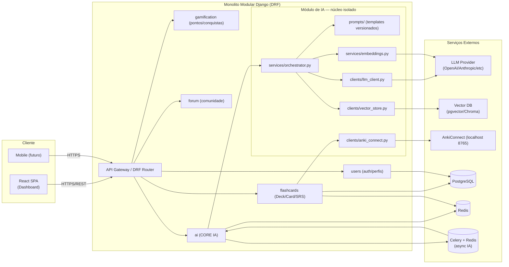
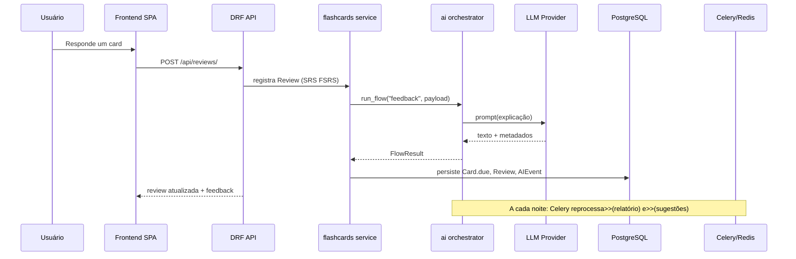

# MemorAI — Software Design Document (SDD)

> Documento gerado a partir de análise multi-agente do repositório (agentes: Requisitos, Arquitetura, Validador).
> Data: 2026-08-05 · Repo: `C:\Users\Herik\Documents\github\MemorAI` · Branch: `prototype`

---

## 1. Visão Geral (Executive Summary)

### Propósito
O **MemorAI** é uma plataforma de ensino de programação fundamentada na **Curva do Esquecimento de Ebbinghaus**, utilizando **repetição espaçada (SRS)** — com integração planejada ao open-source **Anki** — para maximizar a retenção de conhecimento por meio de flashcards, módulos estruturados, gamificação e feedback inteligente.

### Escopo (estado atual)
O repositório está em **estágio MVP/scaffold**: existe um backend mínimo **Django 5.2.5 + DRF 3.16.1** com um único app (`flashcards`) expondo CRUD de `Deck`/`Card` sobre **SQLite**, e um frontend **React 19 + axios** com uma única tela (`Dashboard`) que lista decks. Vários diretórios (`api/`, `data/`, `design/`, `mobile/`, `scripts/`, `tests/`) e arquivos (`docker-compose.yml`, `ROADMAP.md`, `CONTRIBUTING.md`, `docs/architecture.md`, `docs/methodology.md`) são **placeholders vazios**.

### Achado crítico sobre IA
**Não existe, hoje, nenhum código de IA/LLM/embeddings/RAG/vetores no repositório.** A palavra "Inteligente" na proposta ("Feedback Inteligente", "lembretes inteligentes") refere-se a **algoritmos de reposicionamento/notificação** descritos no README, **ainda não implementados**. Logo, **a superfície de IA a preservar neste momento é zero** — e o SDD proposto trata a IA como **camada a ser introduzida de forma isolada e protegida** pela nova arquitetura.

### Público-Alvo
- Estudantes de programação iniciantes e avançados.
- Profissionais em upskilling técnico.
- Instituições de ensino buscando soluções interativas.
- Empresas treinando desenvolvedores.

### Objetivos Principais
1. Retenção eficaz via repetição espaçada (Ebbinghaus + AnkiConnect).
2. Módulos de aprendizado estruturados com exercícios e certificados.
3. Gamificação (pontuação, conquistas, rankings semanais).
4. Dashboard de acompanhamento com sugestões de revisão e lembretes inteligentes.
5. Integração com IDEs / GitHub (execução de código e submissão de projetos).
6. Comunidade/fórum e mentoria.
7. Monetização (freemium, cursos pagos, parcerias).

---

## 2. Arquitetura do Sistema

### 2.1 Padrão arquitetural adotado (recomendado)
**Monolito modular em Django (backend)** + **SPA React (frontend)** + **camada de IA isolada como serviço interno (módulo dedicado)**, evolutiva para **microsserviços** quando a IA/analytics justificar escala horizontal.

Justificativa: manutenção do stack já presente (Django + React), com **fronteira clara** para a IA (própria app Django + service layer) de modo que prompts, chaves e modelos nunca se misturem ao domínio de flashcards. O tráfego de IA é síncrono quando o usuário espera resposta (feedback) e assíncrono via fila quando demandar processamento pesado (relatórios, classificação de dificuldade).

### 2.2 Diagrama lógico (Mermaid)



### 2.3 Componentes de alto nível
| Componente | Função |
|---|---|
| **API Gateway / DRF Router** | Ponto único de entrada REST, versionamento, auth, rate-limit. |
| **flashcards** | Domínio SRS: decks, cards, agendamento de revisão (intervalo/ease/due) + integração AnkiConnect. |
| **users** | Autenticação (Django auth + JWT), perfis, preferências. |
| **gamification** | Pontuação, conquistas, rankings, desafios semanais. |
| **forum** | Tópicos, Q&A, grupos de estudo. |
| **ai (núcleo)** | Orquestra a IA: prompts, chamadas LLM, embeddings, RAG, sugestões de reforço e relatórios. |
| **Celery + Redis** | Execução assíncrona de jobs de IA analítica (relatórios de evolução, recalculo de dificuldade). |
| **PostgreSQL + pgvector** | Dados relacionais **e** armazenamento vetorial em um único backend. |

---

## 3. Módulos e Integrações de IA (O Core)

> Princípio norteador: **a IA é uma camada de serviço isolada, com contracts explícitos, prompts versionados e chaves nunca expostas ao domínio**. Toda chamada a modelos externos passa por um adaptador (`llm_client`) e por `orchestrator`, que aplica fallback, timeout, retry e metrics.

### 3.1 Onde a IA atua no sistema
| Fluxo | Gatilho | Modelo esperado | Saída |
|---|---|---|---|
| **Feedback Inteligente** (README §3 linha 20) | Após resposta do usuário a um card | LLM (chat completion) | Texto explicativo personalizado + sugestão de reforço. |
| **Sugestão de revisão baseada em dados** (README §3 linha 39) | Cron diário / evento Celery | Heurística + LLM (resumo) | Lista priorizada de cards/decks a revisar. |
| **Lembretes inteligentes** (README §3 linha 40) | Agendador + classificador | Heurística/LLM | Notificação contextual. |
| **Relatórios de evolução** (README §3 linha 22,38) | Job assíncrono | LLM (sumarização) | Relatório descritivo do progresso. |
| **Geração/Aprimoramento de Cards** | Autor solicita | LLM (few-shot) | Sugestão de `front`/`back`/tags. |
| **Busca semântica (RAG)** | usuário pesquisa decks/cards | Embeddings + pgvector | Resultados por similaridade. |
| **Classificação de dificuldade** | recoleta de métricas | Heurística supervisionada/LLM | Tag de dificuldade por usuário. |

### 3.2 Orquestração
- **`ai/services/orchestrator.py`**: ponto único com função `run_flow(name, payload) -> FlowResult`. Cada fluxo (feedback, suggestion, report, generation, rag) é um `Flow` com prompt, modelo, schema de saída (JSON validado) e política de retry.
- **Cache por hash(prompt + inputs)** em Redis (TTL por fluxo) para evitar re-chamadas idênticas.
- **Modo degradado**: se o LLM falhar/timeout, o fluxo retorna heurística determinística (ex.: FSRS para agendamento) — a IA nunca bloqueia a UX.

### 3.3 Isolamento e proteção das integrações de IA
- **App Django separada** (`ai/`): dependências e fatalities encapsuladas; o restante do codebase depende apenas de `ai.services` (interface estável).
- **Adapter pattern em `ai/clients/llm_client.py`**: abstrai provedor (OpenAI/Anthropic/Azure/Ollama) — troca sem tocar chamadores.
- **Prompts versionados** em `ai/prompts/*.yaml` com `version:` em metadata; mudanças auditadas em Git. Nunca strings literais em views.
- **Chaves**: lidas **somente** em runtime via `os.environ`/`django-environ` na `settings`; passadas ao cliente via DI; proibido logar payloads que possam conter PII ou chaves.
- **Rate-limit & custo**: middleware conta tokens por usuário ( tabela `ai_usage`) e impõe cotas; alertas em gasto acumulado.
- **Guardrails**: camada `ai/safety/` valida entrada/saída (PII, conteúdo) antes de persistir.

### 3.4 Mapeamento ai Hera atual vs. nova
| Item no README (linha) | Estado atual | Local proposto |
|---|---|---|
| Feedback Inteligente (20) | ausente | `ai/flows/feedback.py` |
| Sugestões de revisão (39) | ausente | `ai/flows/review_suggestion.py` |
| Lembretes inteligentes (40) | ausente | `ai/flows/reminder.py` |
| Relatórios personalizados (22,38) | ausente | `ai/flows/report.py` (Celery) |
| AnkiConnect API (26,54,67) | ausente; `Card` sem campos SRS | `flashcards/services/anki.py` + campos SRS no modelo |

---

## 4. Design de Dados

### 4.1 Estado da aplicação
- **Persistente**: PostgreSQL relacional (flashcards, reps, users, gamification, forum, `ai_usage`, embeddings via pgvector).
- **Efêmera/cache**: Redis (sessões, cache de prompts, filas Celery, locks).
- **Local do usuário**: Anki via AnkiConnect (somente para decks sincronizados).

### 4.2 Fluxo das informações


### 4.3 Schema essencial (proposto)
- **`Deck`** (adicionar `owner`, `is_public`, `difficulty`, `tags`).
- **`Card`** estendido com campos SRS: `interval`, `ease`, `due`, `reps`, `lapses`, `last_reviewed_at`, `srs_algorithm` (FSRS/SM2/Anki).
- **`Review`** (nova): `user`, `card`, `rating` (Again/Hard/Good/Easy), `reviewed_at`, `time_ms`, `feedback_text` (gerado por IA), `feedback_source`.
- **`AIEvent`** (nova): `flow_name`, `prompt_version`, `model`, `tokens_in`, `tokens_out`, `latency_ms`, `cost_usd`, `status`, `user`, `created_at` — auditoria completa das chamadas de IA.
- **`Embedding`** (nova): `entity_type` (deck/card), `entity_id`, `embedding(vector)`, `model`, `version`.
- **`ai_usage`**: quotas e rate-limit por usuário.

### 4.4 Estratégias de cache
- **Prompts compilados**: cache local (Django caches) por versão.
- **Embeddings de cards**: recalculados só em `Card.save()` quando `back/front` muda.
- **Feedback de IA**: cache por `(card_id, rating, card_version)` em Redis por 30 dias.
- **Decks públicos**: cache HTTP (ETag) na listagem.

### 4.5 Persistência
- Migração de SQLite → **PostgreSQL** (prod). SQLite mantido somente em testes.
- `pgvector` habilita coluna `vector` para RAG sem outro serviço.

---

## 5. Design de API / Interfaces

### 5.1 Convenções
- Prefixo `/api/v1/`.
- DRF ViewSets + Routers; autenticação JWT ( SimpleJWT ); permissões por escopo.
- Serializers Pydantic-style explícitos; schemas OpenAPI via `drf-spectacular`.

### 5.2 Endpoints principais (proposto)
| Método + Path | Recurso |
|---|---|
| `GET/POST /api/v1/decks/` | CRUD decks |
| `GET/POST /api/v1/decks/{id}/cards/` | CRUD cards |
| `POST /api/v1/cards/{id}/review/` | registra review + dispara feedback IA |
| `GET /api/v1/dashboard/` | agregados de progresso |
| `POST /api/v1/ai/feedback/` | só IA: feedback isolado |
| `POST /api/v1/ai/suggestions/` | sugestões de revisão |
| `POST /api/v1/ai/generate-card/` | geração assistida de card |
| `GET /api/v1/ai/report/` | relatório de evolução (job async, polling) |
| `POST /api/v1/anki/sync/` | sincroniza deck com AnkiConnect |
| `/api/v1/auth/...` | JWT login/refresh |
| `/api/v1/leaderboard/` | ranking semanal |

### 5.3 Interfaces internas (contracts)
- **`ai.services.Orchestrator.run_flow(flow: str, payload: dict) -> FlowResult`** — interface estável usada por todos os apps Django.
- **`ai.clients.LLMClient.complete(model, messages, schema) -> dict`** — contract com provedores; implementações `OpenAIClient`, `AnthropicClient`, `OllamaClient`.
- **`flashcards.services.scheduler.Scheduler.schedule(card, rating) -> ScheduleUpdate`** — FSRS/SM2 pluggável.
- **`flashcards.services.anki.AnkiConnect.sync(deck) -> SyncReport`**.

### 5.4 Frontend → Backend
- Camada `frontend/src/api/` com um módulo por recurso (`decks.ts`, `ai.ts`, `review.ts`), todos sobre a instância axios central (`baseURL = process.env.REACT_APP_API_URL`).
- Erros normalizados por interceptor → toast ou retry controlado.

---

## 6. Nova Estrutura de Diretórios (Codebase)

> Distintivos: move de "organização Django ad-hoc" para monolito modular explícito, com **caminho dedicado e autocontido para IA**. Mantém `backend/` e `frontend/` mas racionaliza diretórios vazios.

```
memorai/
├── README.md
├── CONTRIBUTING.md            # preencher
├── ROADMAP.md                 # preencher
├── LICENSE
├── docker-compose.yml         # web + db + redis + worker
├── docker-compose.override.yml  # dev overrides (opcional)
├── .env.example               # todas as vars exigidas, documentadas
├── .github/workflows/         # CI: lint, testes backend+frontend, build
├── pyproject.toml             # ruff, black, mypy, pytest (config central)
├── package.json               # apenas se realmente necessário na raiz; senão remover
│
├── docs/
│   ├── SDD.md                 # <- este documento
│   ├── architecture.md        # diagrama atualizado
│   ├── methodology.md         # Ebbinghaus, FSRS, microlearning
│   ├── api/                   # OpenAPI exportado (drf-spectacular)
│   ├── prompts/               # spec de prompts versionados (espelho legível)
│   └── adr/                   # Architecture Decision Records
│       ├── 0001-postgres-pgvector.md
│       ├── 0002-ai-as-isolated-module.md
│       └── 0003-fsrs-default-scheduler.md
│
├── backend/
│   ├── Dockerfile
│   ├── .env                    # gitignored (já existe vazio)
│   ├── requirements.txt        # preencher: Django, DRF, psycopg, redis, celery, openai, anthropic, drf-spectacular, SimpleJWT, pgvector
│   ├── manage.py
│   ├── pyproject.toml          # configuração ruff/mypy do backend (ou usar o da raiz)
│   ├── memorai/                  # projeto Django
│   │   ├── __init__.py
│   │   ├── settings/
│   │   │   ├── base.py
│   │   │   ├── dev.py
│   │   │   ├── prod.py
│   │   │   └── test.py
│   │   ├── urls.py
│   │   ├── asgi.py
│   │   └── wsgi.py
│   ├── apps/
│   │   ├── __init__.py
│   │   ├── flashcards/           # domain SRS
│   │   │   ├── models.py          # Deck, Card (+SRS fields), Review
│   │   │   ├── serializers.py
│   │   │   ├── views.py
│   │   │   ├── urls.py
│   │   │   ├── admin.py
│   │   │   ├── services/
│   │   │   │   ├── scheduler.py   # FSRS/SM2 pluggável
│   │   │   │   └── anki.py        # cliente AnkiConnect
│   │   │   ├── tasks.py           # Celery hooks
│   │   │   └── migrations/
│   │   ├── users/                 # auth, perfis, preferências
│   │   ├── gamification/          # pontos, conquistas, rankings
│   │   ├── forum/                 # comunidade, Q&A
│   │   ├── dashboard/             # agregacão de métricas
│   │   └── ai/                    # ===== NÚCLEO IA (isolado) =====
│   │       ├── __init__.py
│   │       ├── apps.py
│   │       ├── models.py          # AIEvent, AIUsage, Embedding
│   │       ├── admin.py
│   │       ├── urls.py
│   │       ├── views.py           # endpoints /api/v1/ai/*
│   │       ├── services/
│   │       │   ├── orchestrator.py   # run_flow(name, payload)
│   │       │   ├── flows/
│   │       │   │   ├── feedback.py
│   │       │   │   ├── review_suggestion.py
│   │       │   │   ├── reminder.py
│   │       │   │   ├── report.py
│   │       │   │   ├── generate_card.py
│   │       │   │   └── rag.py
│   │       │   ├── embeddings.py
│   │       │   ├── cost.py          # contabiliza tokens/custo
│   │       │   └── metrics.py
│   │       ├── clients/
│   │       │   ├── llm_client.py     # ABC + factory
│   │       │   ├── openai_client.py
│   │       │   ├── anthropic_client.py
│   │       │   ├── ollama_client.py
│   │       │   └── vector_store.py   # pgvector
│   │       ├── prompts/             # versionados (.yaml + metadados)
│   │       │   ├── feedback.en.yaml
│   │       │   ├── feedback.pt.yaml
│   │       │   ├── generate_card.yaml
│   │       │   └── report.yaml
│   │       ├── safety/              # guardrails, PII, moderação
│   │       ├── tasks.py             # jobs Celery (report, recalculo)
│   │       └── migrations/
│   ├── config/
│   │   ├── celery.py
│   │   └── urls.py                  # roteador central → apps
│   └── tests/
│       ├── conftest.py
│       ├── test_flashcards_srs.py
│       ├── test_ai_orchestrator.py
│       └── test_ai_flows.py
│
├── frontend/
│   ├── Dockerfile
│   ├── package.json               # fix react-scripts pin real
│   ├── tsconfig.json               # migrar JS→TS (recomendado)
│   ├── tailwind.config.ts
│   ├── postcss.config.js
│   ├── .env                       # REACT_APP_API_URL
│   ├── public/
│   └── src/
│       ├── main.tsx
│       ├── App.tsx
│       ├── router.tsx             # react-router-dom
│       ├── api/
│       │   ├── client.ts          # axios instance central
│       │   ├── decks.ts
│       │   ├── cards.ts
│       │   ├── review.ts
│       │   └── ai.ts
│       ├── pages/
│       │   ├── DashboardPage.tsx
│       │   ├── DeckPage.tsx
│       │   ├── ReviewPage.tsx
│       │   ├── ReportPage.tsx
│       │   └── LoginPage.tsx
│       ├── components/
│       ├── hooks/
│       ├── store/                  # zustand (leve) ou Redux Toolkit
│       ├── styles/
│       └── types/
│
├── mobile/                        # placeholder reservado (Flutter futuro)
├── scripts/
│   ├── seed_decks.py              # popular decks de exemplo
│   ├── run_anki_sync.py
│   └── lint.sh
└── tests/
    └── e2e/                       # Playwright/Cypress
```

### Responsabilidade por diretório
| Diretório | Responsabilidade |
|---|---|
| `docs/` | Documentação viva (SDD, ADRs, prompts espelho, metodologia, OpenAPI). |
| `docs/adr/` | Decisões arquiteturais datadas e justificadas. |
| `backend/memorai/settings/{base,dev,prod,test}.py` | Configuracão por ambiente; segredos via env. |
| `backend/apps/` | Apps Django modulares (um por domínio). |
| `backend/apps/flashcards/` | Domínio SRS agnóstico a IA. |
| `backend/apps/ai/` | **Núcleo de IA** isolado e protegido. |
| `backend/apps/ai/services/flows/` | Cada fluxo de IA como módulo testável. |
| `backend/apps/ai/clients/` | Adaptadores de provedores externos (LLM, vector store). |
| `backend/apps/ai/prompts/` | Prompts versionados em YAML. |
| `backend/apps/ai/safety/` | Guardrails e moderação. |
| `backend/config/` | Wire-up do Celery e do roteador central. |
| `backend/tests/` | Testes unitários/integraçãopytest. |
| `frontend/src/api/` | Camada única de acesso HTTP (módulos por recurso). |
| `frontend/src/pages/` | Páginas roteadas. |
| `frontend/src/store/` | Estado global leve. |
| `tests/e2e/` | Testes end-to-end. |
| `scripts/` | Automatizacões pontuais. |

---

## 7. Infraestrutura e Segurança

### 7.1 Execução
- **Docker Compose** serviços:
  - `db` (PostgreSQL 16 + pgvector)
  - `redis` (cache + broker)
  - `web` (Django gunicorn/uvicorn)
  - `worker` (Celery)
  - `frontend` (nginx servindo build; em dev, `npm start` na porta 3000)
- Profiles: `dev`, `prod`, `test`.

### 7.2 Variáveis de ambiente (`.env.example`)
```
DJANGO_SETTINGS_MODULE=memorai.settings.prod
DJANGO_SECRET_KEY=
DJANGO_DEBUG=False
ALLOWED_HOSTS=
CORS_ALLOWED_ORIGINS=
DATABASE_URL=postgres://memorai:***@db:5432/memorai
REDIS_URL=redis://redis:6379/0
ANKI_CONNECT_URL=http://host.docker.internal:8765

# IA — chaves nunca no código, nunca em logs
LLM_PROVIDER=openai            # openai|anthropic|azure|ollama
OPENAI_API_KEY=
ANTHROPIC_API_KEY=
AZURE_OPENAI_ENDPOINT=
AZURE_OPENAI_API_KEY=
OLLAMA_BASE_URL=
LLM_DEFAULT_MODEL=gpt-4o-mini
LLM_TIMEOUT_SECONDS=30
LLM_MAX_TOKENS=1024

# RAG / embeddings
EMBEDDING_MODEL=text-embedding-3-small
EMBEDDING_DIM=1536

# Cotas
AI_DAILY_TOKEN_CAP_PER_USER=200000
AI_DAILY_COST_CAP_USD=10
```

### 7.3 Segurança
- **Segredos fora do repo** (`backend/.env` e `frontend/src/.env` já gitignored; `backend/memorai/settings.py:23` atualmente tem `SECRET_KEY` hardcoded — **mover para `django-environ`**).
- **`DEBUG=False`**, `ALLOWED_HOSTS` explícito, HTTPS-only em prod.
- **Auth**: SimpleJWT + refresh rotation; senha validada pelos validators já presentes (`settings.py:88-101`).
- **Rate-limit IA** por usuário (`AI_DAILY_TOKEN_CAP_PER_USER`/cost cap) via middleware e tabela `ai_usage`.
- **Guardrails de IA** (`ai/safety/`): PII masking em prompts, moderação de saída, schema JSON validado (`pydantic`).
- **AnkiConnect** roda só no localhost do usuário; backend nunca expõe essa porta; integração opcional e consentida.
- **Logs**: nivel INFO sem payloads; nivel DEBUG (somente dev) pode conter metadados, **nunca chaves**; `AIEvent` persiste metadados de auditoria mas não o plaintext completo por default.

### 7.4 CI/CD
- GitHub Actions: `ruff check`, `mypy`, `pytest`, `npm run lint`, `npm test`, `npm run build`.
- Cobertura mínima exigida para `backend/apps/ai/` (alta criticidade).
- Build das imagens Docker em PRs; deploy manual em `main`.

---

## 8. Decisões de Design (Trade-offs)

| # | Decisão | Alternativa considerada | Justificativa |
|---|---|---|---|
| 1 | **Monolito modular Django** | Microsserviços desde o início | Time pequeno/MVP; escalar só quando IA/analytics demandar. Adicionar microsserviços depois é barato porque a fronteira `ai` já existe. |
| 2 | **IA como app Django isolada** (`apps/ai/`) | IA acoplada em `flashcards/views.py` | Isolamento permite versionar prompts, trocar provedores, auditar custo e testar sem tocar domínio; reduz risco de "descaracterizar" a IA futura. |
| 3 | **Adapter `llm_client`** | Import direto de `openai` nas views | Troca de provedor sem refactor; mocks em testes; controle central de timeout/retry/custo. |
| 4 | **Prompts em YAML versionados** | Strings em `.py` | Auditabilidade (Git), i18n fácil (`.pt.yaml`/`.en.yaml`), A/B de prompts. |
| 5 | **PostgreSQL + pgvector** | PostgreSQL + Chroma/Pinecone | Um só serviço para relacional e vetorial reduz custo operacional; suficiente até escala elevada. |
| 6 | **FSRS/SM2 pluggável em `flashcards/services/scheduler.py`** | Algoritmo ad-hoc ou só Anki | Estado atual (`models.py`) não tem campos SRS; FSRS é estado-da-arte para SRS para programadores; AnkiConnect fica como canal opcional. |
| 7 | **Celery + Redis para IA analítica** | Tudo síncrono | Relatórios e recalculo de dificuldade são pesados; filas evitam bloquear endpoints e permitem retries. |
| 8 | **Frontend TypeScript + react-router** | JS puro + tela única (atual) | Estado atual (`Dashboard.js` único) é insuficiente para o roadmap; TS reduz bugs e router dá base às múltiplas features do README §4. |
| 9 | **`pyproject.toml` central + `requirements.txt` materializado** | `requirements.txt` vazio (atual) | Reprodutibilidade; `backend/requirements.txt` hoje está vazio — arranque técnico necessário. |
| 10 | **Docs/ADRs no repo** | `docs/architecture.md` vazio (atual) | Decisões importantes (DB, IA, scheduler) merecem rastro histórico; o placeholder vazio hoje é débito. |
| 11 | **`.env.example` completo** | `.env` vazio (atual) | Onboarding determinístico e checklist de segredos obrigatórios. |
| 12 | **Preservar e ampliar a proposta de IA do README** | Tratar IA como "nice-to-have" | O usuário explicitou que a IA é o NÚCLEO e não pode ser descaracterizada; o SDD formaliza essa proteção com app isolada, contracts e ADRs. |

### 8.1 Débitos técnicos identificados no estado atual (a corrigir)
- `backend/requirements.txt` vazio — sem pinagem, irreprodutível.
- `backend/memorai/settings.py:23` — `SECRET_KEY` hardcoded (prefixo `django-insecure-`).
- `docker-compose.yml`, `ROADMAP.md`, `CONTRIBUTING.md`, `docs/architecture.md`, `docs/methodology.md` vazios.
- Diretórios `api/`, `data/`, `design/`, `mobile/`, `scripts/`, `tests/` vazios — reorganizados na nova estrutura.
- `frontend/package.json:13` — `react-scripts` em `^0.0.0` (pin quebrado).
- `frontend/src/components/` e `frontend/src/styles/` vazios.
- `frontend/src/api/api.js:4` — `baseURL` hardcoded em `http://127.0.0.1:8000/api/`; mover para `REACT_APP_API_URL`.
- `Card` sem campos SRS (`interval`, `ease`, `due`, `reps`) — inviabiliza o core do produto (repetição espaçada).

---

## 9. Plano de Migração (resumo)

1. **Sprint 0 — Fundação**: preencher `requirements.txt`, `.env.example`, `docker-compose.yml`; mover `SECRET_KEY` para env; criar `apps/` e migrar `flashcards` para `apps/flashcards/`.
2. **Sprint 1 — SRS**: adicionar campos SRS a `Card`, introduzir `Review`, implementar `scheduler.py` (FSRS), endpoint `POST /cards/{id}/review/`.
3. **Sprint 2 — Núcleo IA**: criar `apps/ai/` com `orchestrator`, `llm_client`, `ai/flows/feedback.py`, prompts versionados, `AIEvent`, rate-limit; expor `/api/v1/ai/feedback/`.
4. **Sprint 3 — RAG**: embeddings + pgvector + `ai/flows/rag.py`; busca semântica de decks.
5. **Sprint 4 — Analitycs assíncrono**: Celery + Redis; `report.py` e `review_suggestion.py` como jobs.
6. **Sprint 5 — Frontend**: router, TypeScript, telas (Review, Report, Login); conectar endpoints de IA e SRS.
7. **Sprint 6 — AnkiConnect**: `flashcards/services/anki.py` + sincronização opcional.

---

## 10. Riscos e Mitigações

| Risco | Mitigação |
|---|---|
| Custos de LLM fora de controle | `AI_DAILY_COST_CAP_USD`, cache por hash, modo degradado heurístico. |
| Prompts "drift" entre ambientes | Versionamento YAML + ADR; testes de snapshot de saída. |
| Perda da identidade "IA como núcleo" | App `ai/` com boundaries; gate CI exige que chamadas de IA passem por `orchestrator`. |
| AnkiConnect só funciona local | Documentação + feature flag; sync opcional. |
| Bloqueio do produto por indisponibilidade de LLM | Fallback determinístico (FSRS puro, feedback template). |

---

_Fim do SDD. Este documento é a fonte única de verdade arquitetural; ADRs em `docs/adr/` complementam decisões pontuais._
